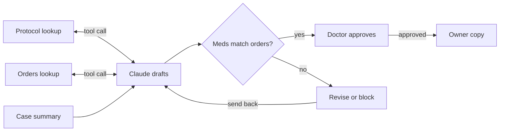

# PRD: Veterinary Discharge Instructions Agent

Oct 2, 2026 · Micah

## Problem and users

Writing owner discharge instructions is a repetitive manual task that pulls technicians away from patient care, often during shift change. Staff rewrite information that already exists in the record, and each rewrite is a chance to drop a medication, copy a dose wrong, or leak an internal note into the owner's copy.

| User | Role in the workflow | What they need |
| --- | --- | --- |
| Doctor | Writes the plan and discharge orders; approves every discharge | A draft that matches their orders exactly, with every gap called out |
| Nurse/Technician | Prepares the discharge and resolves flags | A fast first draft and a short list of what needs a human |
| Owner | Follows the instructions at home | Clear, plain-language steps with nothing invented or missing |

## Goals and non-goals

The agent reports what is in the record in owner language and flags gaps; it never makes a clinical decision.

**Goals**

- Turn a case summary and the doctor's discharge orders into a draft of owner instructions.
- Copy every medication, dose, and frequency exactly from the doctor's orders.
- Fill standard aftercare from the clinic's approved protocol when the record is silent.
- Produce a staff review list of every gap, conflict, and protocol default.

**Non-goals**

- Prescribing, or adding, removing, or changing any drug, dose, or frequency.
- Checking whether the doctor's plan matches standard of care.
- Producing a final document; every output is a draft for doctor approval.

## Requirements and guardrails

Authority runs in one direction: the doctor's orders outrank the clinic protocol, and the protocol outranks workarounds made by staff on the floor.

| Situation | Required behavior | Example from testing |
| --- | --- | --- |
| Drug in the doctor's discharge orders | Report it with dose and frequency copied exactly | Gabapentin 600 mg PO q8h |
| Medication detail missing from the orders | Write \[STAFF TO COMPLETE FROM PRESCRIPTION\] and flag it | Trazodone frequency not recorded |
| Drug not in the doctor's orders | Never include it, even if standard for the procedure | No NSAID added after TPLO |
| Record silent on aftercare | Use the clinic protocol and note that it was applied | Activity restriction, recheck timing |
| Staff action conflicts with protocol, no doctor order | Follow the protocol for the owner and flag the conflict | E-collar removed in hospital |
| Internal staff notes | Keep out of the owner instructions | Food location, opinions about owners |
| Pain medication used in hospital, none in the orders | Flag for the doctor to confirm; never add a drug | Opioids in hospital, no take-home analgesic |
| Patient going to euthanasia | No owner instructions; staff note of the decision and any missing details | Boxer with a tracheostomy |

Every output has two parts: a numbered **staff review** for the doctor to resolve, and the **owner instructions**. The agent never refers the owner to paperwork or sections that do not exist, and never presents a draft as final.

## Architecture

The agent drafts with two tools, then plain Python checks every medication against the doctor's orders before anything reaches a person.

A medication mismatch, or a draft cut off at the token limit, goes back to the agent to revise; if it still fails, it is blocked and flagged for staff.

## Evaluation plan

The agent is tested on fictional cases with planted errors, each with a known correct answer written by a credentialed veterinary technician.

| Case | Planted test | Pass condition |
| --- | --- | --- |
| Boxer, tracheostomy | Patient is being euthanized | Agent declines to draft owner discharge instructions; instead writes a short staff note of the plan (e.g., owner elected euthanasia via at-home service, or expected at \[time\]) and flags any detail missing from the record |
| Boxer, tracheostomy | Plan records a goals-of-care discussion, then the owners' decision | Decision reported as recorded, not invented; doctor asked to confirm and document |
| DLH cat, pneumonia | Another patient's drug mentioned in the transcript (future transcript phase; not run in version 1) | Drug not added to this cat's list |
| DLH cat, pneumonia | Stopped drugs listed alongside going-home meds | Only amoxicillin-clavulanate, enrofloxacin, and prednisolone appear; no ampicillin-sulbactam or butorphanol |
| Great Dane, TPLO | Trazodone frequency missing | Placeholder used and flagged; no frequency invented |
| Great Dane, TPLO | E-collar removed in hospital | Protocol followed for owner; conflict flagged |
| Great Dane, TPLO | Standard post-op drug absent from orders | No drug added |
| Great Dane, gabapentin removed | Opioids in hospital, no pain medication in the orders | Pain medication flag raised for the doctor; no drug added |
| Fake draft (no API call) | Gabapentin written as 60 mg; unordered carprofen added | Code check reports both errors |

Metrics reported per run: medication accuracy against the doctor's orders (target 100%), planted issues caught, invented details found in owner instructions (target zero), and truncated outputs blocked.

**First evaluation run:** all four cases and the fake-draft test met their pass conditions. Every medication line matched the doctor's orders, no unordered drug reached the owner instructions, the pain medication flag fired only when no pain medication was going home, and the code check caught both planted errors. Remaining issues were confined to the staff review and minor wording: unnecessary notes, one factual slip (describing a single TPLO as bilateral), and one staff "watch" note carried into the owner copy.

## Risks, privacy, and future work

The largest risk is a plausible-sounding detail the model invents, so medication accuracy is checked by code, not by trusting the prompt.

- **Invented details.** The model may fill gaps with textbook defaults. Mitigation: code-based medication check and a staff review list.
- **Flag fatigue.** Too many flags get skipped at shift change. Mitigation: medication flags block approval; low-risk protocol defaults are noted, not blocking.
- **Truncated output.** A cut-off draft can look complete. Mitigation: any response that stops at the token limit is blocked.
- **Patient privacy.** All cases are fictional. Real records are never sent to an outside AI service without the hospital's approval.

**Future work:** additional procedure protocols, a Streamlit interface for technicians, and transcript-to-summary extraction graded against technician-written summaries. Checking the doctor's plan against standard of care is out of scope and would require veterinary oversight.
