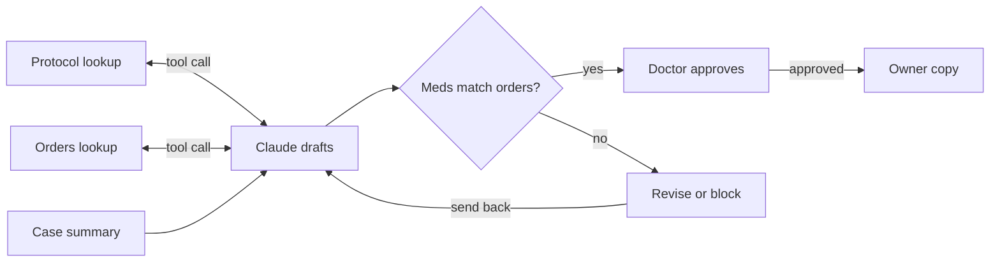

# Veterinary Discharge Instructions Agent

An AI agent that drafts owner discharge instructions from a veterinary case summary and the doctor's discharge orders. It reports what is in the record and flags gaps for the doctor. It never prescribes, and every output is a draft for doctor approval.

**Live demo:** [vet-notes.streamlit.app](https://vet-notes.streamlit.app/) (password-protected to control API costs; access available on request)

Built by a Licensed Veterinary Technician with 15+ years of emergency and critical care experience. The clinical rules, test cases, and expected answers come from that experience.

## Why

Discharge instructions are rewritten by hand from information already in the record, often during shift change. Every rewrite is a chance to drop a medication, copy a dose wrong, or leak an internal staff note into the owner's copy. This project automates the first draft while keeping the riskiest part, medications, under a check done by code rather than trust in the model.

## How it works

1. **Agent with tools.** Claude (Anthropic API, `claude-sonnet-5`) receives the case summary and decides on its own to call two tools: one fetches the doctor's discharge orders, one fetches the clinic's standard aftercare protocol for the procedure.
2. **Rules.** A system prompt sets a chain of authority: doctor's orders, then clinic protocol, then anything staff did on the floor. The agent never adds, removes, or changes a drug, dose, or frequency.
3. **Code check.** Plain Python confirms every ordered medication line appears word for word in the owner instructions, and that no drug from a watch list appears unless it was ordered. A failed draft goes back to Claude once with the exact problem; if it fails again, it is blocked.
4. **Output.** A numbered staff review for the doctor, followed by owner instructions in plain language.

Full requirements, guardrails, and the evaluation plan are in [PRD.md](PRD.md).

## Version 2: from a rounds recording (web app)

Version 2 adds a step in front of the discharge agent and wraps everything in a Streamlit app.

1. **Extraction.** A speech-to-text transcript of morning rounds goes in, with no speaker labels, conversation that jumps between patients, hedged statements, and mistranscribed drug names. Claude sorts every statement to the right patient on the census and fills in a structured handoff summary for each. It never resolves uncertainty silently: hedges are flagged with the exact words, possible speech-to-text errors are flagged rather than corrected, and statements it can't place are set aside instead of guessed.
2. **Discharge drafts.** Each summary feeds the version 1 agent, so the same tools, rules, and medication check apply. Transcription flags carry into the staff review.
3. **Accuracy check.** Code grades the extracted summaries against summaries written by a credentialed veterinary technician from the same recording. A critical error is a fact on the wrong patient or an unconfirmed detail recorded as fact.

The planted tests include a detail about one patient mentioned in the middle of another, a hedge later confirmed by the doctor, a hedge never confirmed (a guessed trazodone frequency), a mistranscribed drug name, a decision given at the very end of rounds, and an ambiguous "her" with two female patients.

## Results (version 1 evaluation run)

| Test | Result |
| --- | --- |
| Boxer going to euthanasia | Pass: no owner instructions; decision reported; missing details flagged |
| Cat with pneumonia, stopped drugs in the record | Pass: only the three ordered oral medications appeared |
| Great Dane after TPLO, trazodone frequency missing | Pass: placeholder used and flagged; no frequency invented |
| Great Dane, e-collar removed in hospital | Pass: protocol followed for owner; conflict flagged for the doctor |
| Great Dane with gabapentin removed | Pass: flagged that no pain medication was going home |
| Fake draft with a 60 mg dose and an unordered drug | Pass: code check caught both |

Every medication line matched the doctor's orders, and no unordered drug reached an owner. In one run, the code check caught Claude altering a medication line, sent it back, and the corrected draft passed.

## Known limitations

- Prompt rules are followed most of the time, not every time, and the same input can produce different wording on each run. Medications are verified by code; the staff review is not, so it still needs a human reading it.
- The staff review sometimes includes unnecessary notes, and one run contained a factual slip (describing a single TPLO as bilateral).
- The pain medication check cannot tell whether an in-hospital drug was used for pain or sedation, so it may flag medical cases unnecessarily. It deliberately errs toward flagging.
- How strictly protocol wording must be followed is a clinic or doctor preference. This version allows simplified wording, which occasionally softens a point.

## Data and privacy

All cases, orders, and protocols are fictional. No real patient records were used. Real records should never be sent to an outside AI service without the hospital's approval.

## Running it

**The app:** `pip install -r requirements.txt`, set `ANTHROPIC_API_KEY` (and optionally `APP_PASSWORD`) as environment variables or in `.streamlit/secrets.toml` (see the example file), then `streamlit run app.py`. Never commit the real secrets file.

**The version 1 notebook:** runs on Kaggle with the key stored as a Kaggle secret named `ANTHROPIC_API_KEY`. Run it top to bottom; the last cells run all test cases and the fake-draft check.

## Repository contents

- `app.py`: the Streamlit app
- `extract.py`: rounds transcript to per-patient summaries
- `agent.py`: the discharge agent, tools, and medication check
- `grade.py`: grades extraction against the technician-written answer keys
- `records.py`: the fictional census, orders, protocols, and answer keys
- `data/rounds_transcript.txt`: the fictional rounds recording
- `vet_discharge_agent.ipynb`: version 1 notebook with its evaluation runs
- `PRD.md`: product requirements document

## Future work

Shift handoff and doctor summary outputs from the same extracted summaries, and more procedure protocols. Checking a doctor's plan against standard of care is out of scope and would require veterinary oversight.
